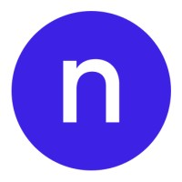
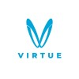
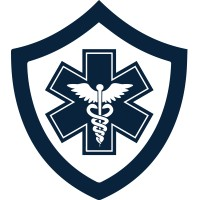
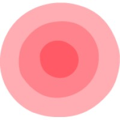

## Novi Connect
- *Sr. Full Stack Engineer* | Jun'22 - Jan'23
- 
- Tags: Full Stack Engineer
- Badges:
  - React [blue] 
  - Ruby [red]
  - Python [green]
  - AWS [yellow]
- List Items:
  - Initiated and executed key full-stack development projects at Novi, contributing to a substantial boost in product adoption and user satisfaction, and played a crucial role in aligning engineering strategies with business objectives for overall revenue growth.
  - Led a significant overhaul of the web product's front-end architecture, resulting in enhanced user experience and increased performance, while fostering a collaborative environment across various teams including Product, Design, and Marketing.

## Virtue
- *Sr. Full Stack Engineer* | Mar'21 - Apr'22
- 
- Tags: Full Stack Engineer
- Badges:
  - Javascript [blue]
  - Firebase [green] 
  - Chrome Extension [red]
- List Items:
  - Oversaw the comprehensive development and deployment of Virtue's landing page and browser extension, achieving a marked increase in user engagement and base; effectively managed and mentored a development team, ensuring seamless execution of projects.
  - Conducted in-depth analysis and redevelopment of user interfaces, leading to significant improvements in user experience and interaction; played a key role in integrating the application with CRM and facilitating its launch in the Google Chrome store.

## MD Ally
- *Full Stack Engineer* | Jun'20 - Nov'21
- 
- Tags: Full Stack Engineer
- Badges:
  - React [blue] 
  - Ruby [red]
  - AWS [yellow]
- List Items:
  - At MDAlly, successfully rewrote and optimized front-end code for core system features using advanced tools like React, Redux, and React Hook Form, significantly enhancing the system's user interface and functionality.
  - Designed and implemented a range of reusable, brand-aligned UI components, substantially reducing development time for future projects, and skillfully utilized Git and CI/CD platforms for superior source control and cross-browser compatibility.

## Phyxable
- *Frontend Engineer* | Oct'19 - Apr'20
- 
- Tags: Frontend Engineer
- Badges:
  - React [blue] 
  - Styled Components [red]
  - Material UI [yellow]
  - Posenet [green]
- List Items:
  - Developed an innovative, user-friendly online platform for Phyxable, utilizing modern front-end technologies to significantly enhance client-therapist interaction and engagement in a digital physiotherapy environment.
  - Spearheaded the design and implementation of real-time video tools and integrated PoseNet for advanced pose estimation, dramatically improving the digital replication of in-person therapy experiences and enhancing therapy outcomes.

## Atadel
- *Backend Engineer* | May'23 - Nov'23
- 
- Tags: Others
- Badges:
  - Flutter [blue] 
  - Nest JS [red]
  - AWS lambda [yellow]
- List Items:
  - At Atadel, engineered highly scalable backend systems using Nest.js and AWS Lambda, optimizing request handling and performance, leading to enhanced system efficiency and reduced infrastructure costs.
  - Collaborated effectively with cross-functional teams to address and solve backend challenges, ensuring seamless integration with front-end systems and contributing to a cohesive and superior user experience.

## Olade
- *Freelance Fullstack Engineer* | May'17 - Nov'19
- 
- Tags: Full Stack Engineer, Others
- Badges:
  - JavaScript [blue] 
  - Laravel [red]
  - React[yellow]
- List Items:
  - Designed and implemented bespoke internal tools and software solutions for gaming companies as a Freelance Full Stack Engineer, significantly enhancing operational efficiency and providing key business insights to drive strategic decision-making.
  - Created and delivered multiple minimum viable products (MVPs) for startups, focusing on scalability, security, and user engagement, and efficiently managed overflow projects for digital agencies, maintaining high client satisfaction under tight deadlines.
