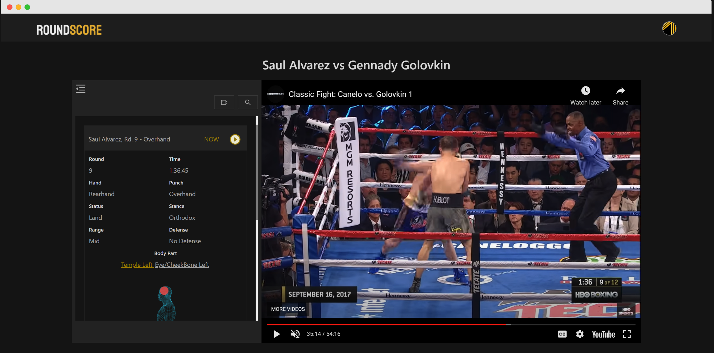
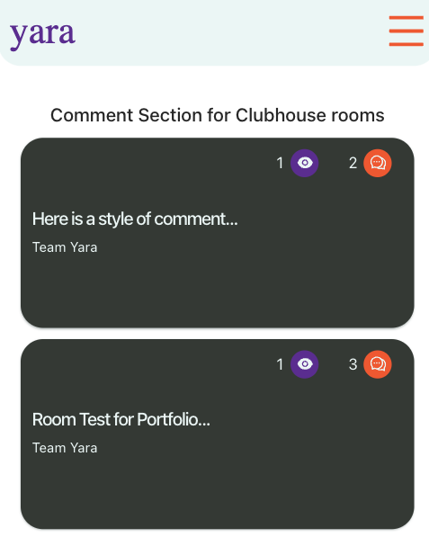
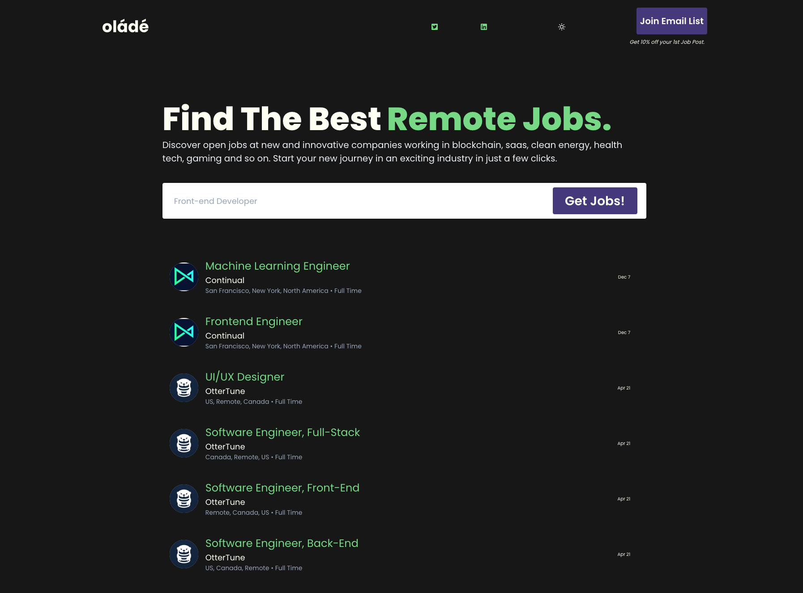

## Roundscore
Created RoundScore, a boxing data platform using React and Firebase. It features comprehensive match analysis tools, including efficient film study and strategy development features like slow-motion replays. My work not only enhanced fight analysis but also built a dedicated community, demonstrating my full-stack development skills and ability to innovate in sports tech."
- 
- Tags: Category 1
- Badges:
  - React [blue]
  - Firestore [yellow]
  - Firebase Storage [purple]
  - Firebase Auth [gray]
  - Ant Design [red]
- Buttons:
  - Link [https://www.roundscore.com/#/]

## Yara
Developed Yara, a unique app enhancing Clubhouse rooms with React and Firebase. It offered engagement tools and a comment section alternative, enriching user experience and room dynamics. Yara also facilitated game tracking and music requests, showcasing my skills in creating interactive, user-focused solutions in a dynamic digital environment.
- 
- Tags: Category 2
- Badges:
  - React [blue]
  - Firebase Cloud functions [green]
  - Firestore [yellow]
  - Firebase Storage [purple]
  - Firebase Auth [gray]
  - Ant Design [red]
- Buttons:
  - Link [https://goyara.netlify.app/]

## Olade
Olade is a job discovery platform I built, catering to careers in blockchain, SaaS, clean energy, health tech, and gaming. Utilizing Next.js, Chakra UI, and various Firebase services, it offers a robust, user-friendly job search experience. My role covered all development phases, ensuring seamless functionality and personalized user experiences.
- 
- Tags: Category 3
- Badges:
  - Next JS [blue]
  - Firebase Cloud functions [green]
  - Firestore [yellow]
  - Firebase Storage [purple]
  - Firebase Auth [gray]
  - Chakra UI [red]
- Buttons:
  - Link [https://olade.vercel.app/]